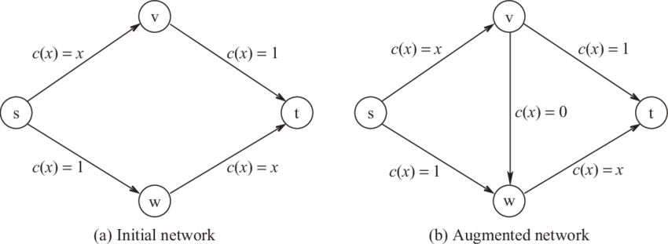

# Auctions and Routing Games

## Auctions

There are many kinds of auctions all around us:

* Single Item Auction → seller has 1 object, which bidders compete to purchase
* Multi-unit Auction → seller has several identical items for sale, and each bidder wants to get one or more units
* Combinatorial Auction → seller has several distinct items for sale, and each bidder is interested in some combination of items (and the values need not be additive)

The important framework here is:

* Each player / bidder has some internal (”true”) valuation for the item(s).
* Seller decides on the price to sell the item(s).

💡 For every auction, when you design an algorithm / mechanism, you need to answer 2 questions:

1. What is the outcome? i.e., who gets what?
2. What is the payment? i.e.,, who pays what?

### Vickery (Second-Price) Auction

Each bidder $$i \in N$$ values the item at $$v_i$$.

There are many different formats for the auctions, but we’ll focus on the sealed-bid auction — where all bidders simultaneously submit their bid, and in particular, the vickery-style auction where the highest bidder wins (outcome) and pays the second highest bid (payment).

Then, this can be viewed as a strategic game with:

* $$n$$ players
* players can place bids (these are the actions) — continuous action space
* payoff: if a player values the object at $$v$$ and the 2nd highest bid is $$p$$, then her payoff is:
  * $$v-p$$ if she gets the object
  * $$0$$ if she does not get the object

One might ask: why does the winner pay the second highest bid (and not his / her own bid)? It tunrs out that:


**In a Vickery Auction, truthful bidding is a (weakly) dominant strategy.**


That is, a player will not regret telling the truth (reporting her true value as the bid)

So, players have no incentive to lie (i.e., this kind of an auction incentivizes bidders to reveal their true valuations — makes it easy for players to bid since they don’t have to think too much, just be honest) — how amazing would it be if we could make honesty a dominant strategy IN LIFE??

Note: this only applies when players cannot collude with each other.

Also remember that the algorithm / framework never knows what the true valuations of the bidders are — it only sees the bids. But since truthfulness is weakly dominant, it can reasonably _assume_ that the bids it sees are the players’ true valuations (since players are assumed to be selfish and greedy).

The proof of this is quite simple (read slides).

All in all, telling the truth is at least as good as any other action.

However, note that there are many nash equilibria in a vickery auction, not just the one where everyone players the dominant strategy of being honest. e.g. $$v_1 = 50, v_2 = 70$$. Then, we have the following NEs:

* $$b_1 = 50, b_2 = 70$$
* $$b_1 = 0, b_2 = 70$$
* $$b_1 = 70, b_2 = 0$$

Observe that in the second and third NEs, the auctioneer makes no profit.

The reason we need to cleverly engineer such an auction format — second-price auction — is because in the usual “first price auction” (highest bidder wins, and pays his bid), truthfulness is not dominant, and so, players have incentive to lie (and hence, the mechanism / algorithm cannot actually ensure that the outcome maximizes total value of all players). e.g. if you value the item for $$100$$ and you bid 100, even if you win, your utility would be (value - payment) = 100 - 100 = 0. In fact, _truthfulness is weakly dominated_ by a strategy that bids strictly less than your valuation. e.g. bid $$90$$ and pray that others’ bids will be lower, so you make 10 with some probability $$p$$ and $$0$$ with probability $$1-p$$. Also, precisely because of this problem of trying to maximize expected value, you don’t know how much to bid — causes a lot of stress to players trying to optimize their bids (by analyzing other people and their potential valuations). Moreover, it’s possible for the item to be given to someone who (truly) values it less than another person, as a result — so the “total value” in society is not maximized. It’s not “pareto efficient”, since the other person can actually pay more to the guy who got the item and everyone is better off.

This shows the importance of cleverly designing a payment mechanism.

### Multi-Unit Auction

Now, suppose we have $$k \leq n$$ identical items for sale. Each bidder $$i \in N$$ wants one item, and values the item at $$v_i$$.

What is the analog of Vickrey auction that ensures bidders submit truthful valuations (and so, the mechanism can maximize social welfare by allocating the items to people who value it the most)?

It turns out that we can use a similar reasoning to design the payment structure as follows: each of the top $$k$$ bidders gets the item, and pay the $$(k+1)$$th highest bid.

(Once we discuss VCG, we can show that this payment structure is a specific example of VCG for multi-unit auction — each player pays the “externality” he imposes on others).

Intuitively: everyone who gets the item should be paying the same amount, since they received the same identical item — otherwise, it’s not “fair” (and it wouldn’t be a Nash Equilibria either, since people would try to lower their bids to pay less). e.g. if you asked the top bidder to pay the second highest bid, the second highest bidder to pay the third highest bid, and so on, that wouldn’t incentive honesty. Because I would try to be the kth highest bidder, and once I’ve seen everyone else’s bids, if I am the highest bid, I would want to lower my bid such that im the kth highest bidder, to pay the least and maximize my utility. So, being honest would not be in my interest in this case.

The two main desirable properties of any auction mechanism is that:

* Truthful bidding is a dominant strategy → so that the mechanism can assume the bids are the true valuations and then maximize total utility.
* Items are allocated to the $$k$$ highest bidders → so that the mechanism “tries” (based on the bids at sees) to maximize total social utility.

If we can get both properties, then the mechanism can _assume_ that everyone is reporting their true values, and it can maximize the total value to everyone (called “social welfare”), _including the auctioneer_.

### Vickrey Clarke Groves (VCG) Mechanism

In general, mechanism design consists of:

* $$N$$ players from $$\{1, \cdots, n \}$$
* Outcomes $$O = o_1, \cdots, o_m$$
* Each player has a valuation function $$v_i : O \to \mathbb{R}$$
* The algorithm can sometimes assign payments $$\pi_1, \cdots \pi_n$$ to each player. Then, a player’s utility for an outcome $$o$$ is given by $$u_i(o) = v_i(o) - \pi_i(o)$$
* The mechanism chooses some outcome $$o^*$$ to maximize some function (called “social choice” function). e.g. utilitarian → $$\sum_i v_i(o^*)$$, try to maximize total “social welfare”

Some desirable properties of a mechanism:

* Incentive Compatibility → reporting your true valuations is a NE. That is, If everyone is being honest, your best choice is to be honest too. Hence, everyone is aligned on the incentive to say the truth.
* Dominant Strategy Incentive Compatibility → reporting your true valuations is a (weakly) dominant strategy. That is, _no matter what other people do_, you could always guarantee that being honest is a best response and you won’t regret it.
*   **Reason why we use “value” in social welfare, and not utility** The reason “social welfare” in an outcome $$o$$ is defined as the total value of all players under that outcome $$o$$ and NOT total _utility_ is quite subtle (yet gives a deeper understanding once you understand it). We also want to consider the auctioneer’s utility. And so, the payment from the bidders goes to the auctioneer, and we can treat the auctioneer’s utility as the sum of all the payment he receives (minus some constant amount that he thinks the items are worth, but that doesn’t matter much). And since the total MONEY in circulation remains the same (just gets transferred from one player to another, in this case the auctioneer), we can actually ignore all payments (and forget above the auctioneer), and focus on maximizing the total value of all the bidders. More formally, let there be $$n$$ players (labelled $$1 \cdots n$$), and 1 auctioneer (labelled 0). Then, if we define social welfare as the total utility of everyone, including the auctioneer, we have:

    $$
    (p_0 - v_0) + \sum_{i=1}^n (v_i - p_i)
    $$

    where $$v_i$$ is the value of the object to person $$i$$, and $$p_i$$ is the amount paid by player $$i$$ under the mechanism (and the auctioneer RECEIVES the payment and GIVES the item, so we need to flip the utility function) This also shows us that if the auctioneer values the item at $$v_0 > \max_{i \in \{1, \cdots, n\}} p_i$$, he should not give it away — he derives more value keeping it than receiving the payment. But okay, suppose that this is not the case, and that the auctioneer gives away all the objects. Observe, that the amount the auctioneer receives is exactly how much the bidders pay (duh). So, $$p_0 = \sum_{i=1}^n p_i$$. And then, we can simplify social welfare to:

    $$
    (\sum_{i =1}^n v_i)- v_0
    $$

    where player $$i$$ receives “value” $$v_i$$ from the object, and 0 if they don’t get the object. And since $$v_0$$ is a constant that does not depend on the allocation of the items among the $$n$$ bidders, we can ignore it when trying to maximize social welfare. HENCE, we can focus on maximizing the total value gained by the bidders alone. (Of course, if we’re considering utility we need to include the auctioneer because if not, he will end up with nothing LOL i.e., if we only consider maximizing bidders’ utility then optimally, the top k bidders get the items and pay nothing for it — and since they pay nothing, it doesn’t even incentivize truthfulness, and so, we aren’t really maximizing bidder’s “true” utility since we can’t reasonably assume that their bids = valuations. Understand the line of reasoning. This is why it’s important to be very careful while designing mechanisms to ensure incentives align with what you want to achieve).

The VCG mechanism is a general framework of truthful mechanisms. It selects socially optimal outcome, and ensures truthful reporting by careful payment design.

In fact, it can only maximize (real) social welfare under the assumption that it receives honest valuations from players, and this assumption is reasonable _because_ the payment designs makes truthfulness a dominant strategy → the logic of WHY VCG works is important! So, the only assumption we’re really making is that players are selfish and greedy, i.e., they care about maximizing their OWN utility, not the joint utility of all players. This is the genius of VCG.

VCG Procedure:

* Outcome: Choose some outcome $$o^*$$ that maximizes $$\sum_i v_i(o^*)$$ → hence, $$o^*$$ is socially optimal.
  *   Payment: Each agent pays the **externality** that she imposes on the other agents. That is, how much value is she “taking” away from the other players by being present. Let $$o_{-j}^*$$ be the outcome that maximizes $$\sum_{i \neq j} v_i$$ → i.e., the social welfare of others in the absence of player $$j$$. Then, player $$j$$ pays: (max welfare of others if j were obsent) $$-$$ (max welfare of others when j is present) which is:

      $$
      \sum_{i \neq j}[v_i(o_{-j}^*) - v_i(o^*)]
      $$

Using this, we can show that Vickery auction is a special case of VCG (as is the multi-unit auction format where each of the top $$k$$ bidders pays the $$(k+1)$$th highest bid, because that’s the externality they impose — in their absence, the $$(k+1)$$th bidder would’ve gotten the item but you “took” it from them so you must pay that much).


**In VCG mechanisms, truthful reporting is a dominant strategy.**


This is the whole point of VCG! And it’s not obvious at first glance.

Remember:

* The mechanism only sees the bids — it maximizes social welfare _assuming the bids represent honest valuations_. But the assumption is just necessary to intrepret what the algorithm is doing — the algorithm just treats the bids as numbers and maximizes a function. In particular, if $$w_{ik}$$ is player $$i$$’s bid for item $$k$$ (assuming we have many items), then the mechanism maximizes $$\sum_k \sum_i w_{ik} \cdot I(i, k)$$ where $$I(i, k)$$ is the indicator variable that represents whether player $$i$$ received item $$k$$ or not.
* In theory, the mechanism never knows whether the bids were honest or not. So, the mechanism cannot calculate any individual’s “utility”. That is, each person’s utility function is private to them since only they know their true valuations. BUT while analyzing the mechanism, we can assume we know everyone’s utility functions by looking into the minds of each bidder, since each individual knows her utility function. And by misreporting, she doesn’t change her true valuation — yes, the mechanism gets a different input and might pick a different outcome, but the individual knows her utility function hasn’t changed. e.g. if $$v_i = 10$$ but you bid $$w_i = 100$$ and have to pay $$50$$ to get the item, your utility is $$-40$$, not $$50$$.
* If there are multiple possible outcomes that have the same social welfare, then it can be shown that no matter which one is picked, the utility of each player doesn’t change.

Okay, let’s prove that honesty is the best policy here.

Let $$w_i$$ be the bid of player $$i$$. Then, the utility of player $$j$$ when she reports truthfully is given by:

$$
v_j(o^*) - \left(\sum_{i \neq j} w_i(o_{-j}^*) - \sum_{i \neq j} w_i(o^*) \right )
$$

Note that player $$j$$ cannot affect the other players’ bids. That is, we actually only ask the players for bids ONE time — we don’t actually remove each player, and ask the other players to report bids. So, the bids of other players don’t depend on player $$j$$’s reported bids (since they don’t even see each other’s bids).

Note that $$v_j$$ is a constant. And by definition, $$o_{-j}^*$$ does not depend on $$j$$’s report.

So, we have:

$$
\sum_{i \neq j} w_i(o_{-j}^*) + \sum_{i \neq j} w_i(o^*) + v_j(o^*)
$$

Now, the mechanism is defined in a way to find a $$o^*$$ that maximizes $$\sum_i w_i(o^*)$$.

And so, for player $$j$$’s incentive to align with what the mechanism is doing, he should report his true value.

> I think it takes a while to really get this — write it down on a piece of paper. See that it doesn’t matter what the other players do i.e., we don’t have to assume other players are being honest, in fact no one will ever know if the players were honest or not (since no one can know the true valuations of anyone else) - the mechanism is just a maximizing function.

### Combinatorial Auctions

We have $$m$$ possible distinct items for sale, and $$n$$ bidders.

So, we have $$(n + 1)^m$$ possible outcomes → for each item, we can either give it to one of the bidders or not give it to anyone (i.e., keep it with the auctioneer).

Bidders can have different valuations for different subsets of items — importantly, the valuations don’t have to be additive. I can value a notebook for $$10, and a pen for$$2, but the combination for \$$15 - since they both become more useful to me when I have both.

VCG still works, and ensures truthfulness but we have some challenges:

* Preference elicitation: Each bidder has $$2^m$$ private parameters.
* Computational issues: Finding the optimal outcome $$o^*$$ may be NP-hard (it’s basically like knapsack)
* Revenue non-monotonicity. That is, adding more bidders can cause the payment (to the VCG mechanism / auctioneer) to decreases, which is very counter-intuitive but true (since it’s possible for a group of bidders to be imposing an externality but none of them individually are). e.g. 2 items (A, B). 2 players (X, Y). X values {A,B} at 10, but values {A} = {B}= 0 (he only wants them together, or not at all). Player Y only values {A} = 11. So, VCG assigns {A} to Y, and Y pays 10. Now, if a player Z enters and values {B} = 11, then player Y still gets {A} and Z gets {B} but both of them pay nothing (because even if Y / Z were absent, the other player would “block” X from getting the “combo set” — so each person’s individual externality is zero).

### Routing

#### Non-Atomic

Braess’s Paradox: Adding an edge (even a magical edge with no cost) can lead to a worse equilibirum since everyone rushes to use that edge. Not just worse off overall, but worse for every individual.

(Adding an edge can NEVER increase the optimal cost.)

<figure><figcaption></figcaption></figure>

In (a) due to obvious symmetry, half the people take the top route and half take the bottom route. Then, the total time for everyone is 1.5 hours (assuming we have one unit of traffic to route, and it is non-atomic).

In (b), everyone would like to go through s → v → w → t, since time x < 1 for any x (until everyone goes through this path). And then, we end up in a situation where everyone takes 2 hours.

The optimal solution here would be to allocate half of them to go via the first route and the other half via the second half.

This is kind of like the prisoner’s dilemna. People try to be selfish and only think of their own utility, leading to a worse situation for everyone (not just _everyone else_, but everyone!). Of course, the reason this is an equilibrium is that everyone is thinking of themselves, and given that everyone is selfish, your best response is also to be selfish.

The key insight here is that selfish behaviour hurts social welfare. We can measure “how much” it hurts social welfare by finding the “Price of Anarchy”.

**Price of Anarchy** is defined to be the ratio of the social cost under the worst Nash Equilibrium and the socially optimal solution.

$$
PoA = \frac{WorstNash(G)}{OPT(G)}
$$

It’s called price of anarchy because the worst Nash equilibrium is the worst-case “stable” state that the people can arrive at with no central authority to force them to do anything. But oftentimes, if we have a central authority that can decide who does what, we can get a better overall outcome (for society) — though not necessarily for every person (some people may have to sacrifice for the overall good). So, the freedom (aka anarchy) comes at a cost (aka price) to everyone.

**In non-atomic (you can split as finely as you want) routing games, all equilibrium flows have the same cost, so we we can take any equilibrium in the numerator above.**

### Atomic Version

Suppose we have $$k$$ units of traffic, where $$k$$ is a positive integer. Each unit must be routed as a whole (think of each unit as a car).

Each edge $$e \in E$$ has a cost function, $$c_e : \mathbb{N} \to \mathbb{R}_{\geq 0}$$.

**In an atomic routing game, a PURE Nash equilibrium flow always exists.**

That is, no player needs to pick routes randomly (in a “mixed actions” way) — he/she can pick a single route, given other people’s choices.

Note that this does NOT follow directly from Nash’s theorem — Nash only says that there exists AN equilibrium, it doesn’t have to be pure. So, this is a stricter condition, and one that is not implied by Nash.

Proof: We can show that every atomic routing game is a **potential game**. And all players are inadvertently (unknowingly / unintentionally) and collectively striving to optimise a **potential function** $$\Phi$$**.**

The cleverness of this proof lies in this choice of potential function(!!), just like the cleverness of VCG lies in their payment design.

$$
\Phi(f) = \sum_{e \in E} \sum_{i = 1}^{f_e} c_e(i)
$$

where $$f_e$$ is the number of players that chose a path that includes the edge $$e$$.

This choice of potential function is not obvious. In particular, note that this doesn’t capture the total cost of everyone — that would be given by: $$\sum_{e \in E} f_e \cdot c_e(f_e)$$ since each of the $$f_e$$ players using that edge would incur a cost of $$c_e(f_e)$$.

But the crucial property is that: If a player deviates from path P to $$\hat P$$, the change in the potential function is:

$$
\Phi(\hat f) - \Phi(f) = \sum_{e \in \hat P} c_e(\hat f_e) - \sum_{e \in P} c_e (f_e)
$$

That is, remove the contribution of this player to the potential when they were using path $$P$$, and then, add the contribution back based on the path $$\hat P$$.

BUT, this is exactly the change in the deviator’s individual cost! In other words, when a player deviates, the change in the potential function is the same as the change in the deviator’s individual cost!

So, a flow that minimizes the potential function is an equilibrium. Hence, we’re done.

Umm.. why are we done? Because out of all the flows, just pick a (not necessarily unique) one with the minimum potential. And that is going to be an equilibrium because no player has any incentive to deviate (if they did, they would do so, and decreasing their cost would also lower the potential function, but by definition, this is the minimum potential value, so its not possible).

A similar proof works for non-atomic routing games - by using integral instead of sum over the cost function.

So, we’ve proven (using the potential function argument) that a _pure_ nash equilibrium flow always exists.
